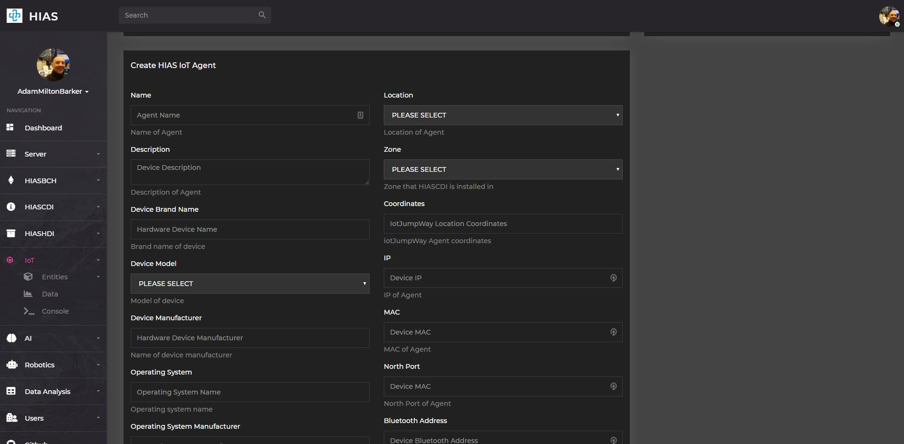

# RPI Installation


# Introduction
This guide will take you through the installation process for the **HIAS MQTT BLE Agent**.

&nbsp;

# Prerequisites
You will need to ensure you have the following prerequisites installed and setup.

## HIAS Core

The HIAS MQTT BLE Agent is a core component of the [HIAS - Hospital Intelligent Automation Server](https://github.com/AIIAL/HIAS-Core). Before beginning this tutorial you should complete the HIAS installation guide ensure your HIAS server is online.

&nbsp;

# Installation
You are now ready to install the HIAS MQTT BLE Agent software.

## Clone the repository

Clone the [HIAS MQTT BLE Agent](https://github.com/AIIAL/HIAS-MQTT-BLE-Agent " HIAS MQTT BLE Agent") repository from the [Asociación de Investigacion en Inteligencia Artificial Para la Leucemia Peter Moss](https://github.com/AIIAL "Asociación de Investigacion en Inteligencia Artificial Para la Leucemia Peter Moss") Github Organization to your Raspberry Pi.

To clone the repository and install the project, make sure you have Git installed. Now navigate to your home dir and then use the following command.

``` bash
 git clone https://github.com/AIIAL/HIAS-MQTT-BLE-Agent.git
```

This will clone the HIAS MQTT BLE Agent repository.

``` bash
 ls
```

Using the ls command in your home directory should show you the following.

``` bash
 HIAS-MQTT-BLE-Agent
```

Navigate to the **HIAS-MQTT-BLE-Agent** directory, this is your project root directory for this tutorial.

### Developer forks

Developers from the Github community that would like to contribute to the development of this project should first create a fork, and clone that repository. For detailed information please view the [CONTRIBUTING](https://github.com/AIIAL/HIAS-MQTT-BLE-Agent/blob/main/CONTRIBUTING.md "CONTRIBUTING") guide. You should pull the latest code from the development branch.

``` bash
 git clone -b "2.0.0" https://github.com/AIIAL/HIAS-MQTT-BLE-Agent.git
```

The **-b "2.0.0"** parameter ensures you get the code from the latest master branch. Before using the below command please check our latest master branch in the button at the top of the project README.

## Installation script

All other software requirements are included in **scripts/install.sh**. You can run this file on your machine from the project root in terminal:

``` bash
 sh scripts/install.sh
```

&nbsp;

# HIAS Setup

This device is a **HIAS IoT Agent** and uses the **HIAS iotJumpWay MQTT Broker** to communicate with the HIAS network. To set up an IoT Agent on the HIAS network, head to your **HIAS Server UI**.

The HIAS network is powered by a context broker that stores contextual data and exposes the data securely to authenticated HIAS applications and devices. Each HIAS IoT Agent has a JSON representation stored in the HIASCDI Context Broker that holds their contextual information.

## HIAS IoT Agent

A HIAS IoT Agent is a bridge between HIAS devices and applications, and the **HIASCDI Context Broker** & **HIAS Historical Broker**. The IoT Agents process incoming data using a specific machine to machine communication protocol and then converting into a format compatible with HIASCDI, before sending the data to HIASCDI to update the contextual information.


You will now need to create your HIAS IoT Agent and retrieve the agent credentials. Navigate to **IoT->Entities->Agents** and click on the **+** next to the **Network Agents** title to create a HIAS IoT Agent.



Make sure to select **MQTT** as the protocol for your Agent. Once you have completed the form and submitted it, you can find the newly created AI Agent by navigating to **IoT->Entities->Agents** and clicking on the relevant Agent.

On the HIAS IoT Agent page you will be able to update the contextual data for the agent, and also find the JSON representation.


You now need to download the credentials required to connect the Acute Lymphoblastic Leukemia oneAPI Classifier to the HIAS network.

Click on the **Agent Credentials** section to download the credentials file. This should open your file browser, navigate to the **HIAS-MQTT-BLE-Agent/configuration/** directory and save the file as **credentials.json**.

The final configuration you have to do is in the **configuration/config.json** file.

``` json
{
    "agent": {
        "params": [],
        "api": {
            "content": "application/json"
        },
        "proxy": {
            "up": ""
        }
    }
}
```

You need to add the following:

- **agent->proxy:** IoT Agent API Key

&nbsp;

# Services
You will now create the services that will run your Blockchain Agent and Agent Replenisher. Making sure you are in the project root, use the following command:

``` bash
sh scripts/service.sh
```

&nbsp;

# Continue
Now you can continue with the HIAS [usage guide](../usage/rpi.md)

&nbsp;

# Contributing
Asociación de Investigacion en Inteligencia Artificial Para la Leucemia Peter Moss encourages and welcomes code contributions, bug fixes and enhancements from the Github community.

Please read the [CONTRIBUTING](https://github.com/AIIAL/HIAS-MQTT-BLE-Agent/blob/main/CONTRIBUTING.md "CONTRIBUTING") document for a full guide to forking our repositories and submitting your pull requests. You will also find our code of conduct in the [Code of Conduct](https://github.com/AIIAL/HIAS-MQTT-BLE-Agent/blob/main/CODE-OF-CONDUCT.md) document.

## Contributors
- [Adam Milton-Barker](https://www.leukemiaairesearch.com/association/volunteers/adam-milton-barker "Adam Milton-Barker") - [Asociación de Investigacion en Inteligencia Artificial Para la Leucemia Peter Moss](https://www.leukemiaresearchassociation.ai "Asociación de Investigacion en Inteligencia Artificial Para la Leucemia Peter Moss") President/Founder & Lead Developer, Sabadell, Spain

&nbsp;

# Versioning
We use SemVer for versioning.

&nbsp;

# License
This project is licensed under the **MIT License** - see the [LICENSE](https://github.com/AIIAL/HIAS-MQTT-BLE-Agent/blob/main/LICENSE "LICENSE") file for details.

&nbsp;

# Bugs/Issues
We use the [repo issues](https://github.com/AIIAL/HIAS-MQTT-BLE-Agent/issues "repo issues") to track bugs and general requests related to using this project. See [CONTRIBUTING](https://github.com/AIIAL/HIAS-MQTT-BLE-Agent/CONTRIBUTING.md "CONTRIBUTING") for more info on how to submit bugs, feature requests and proposals.